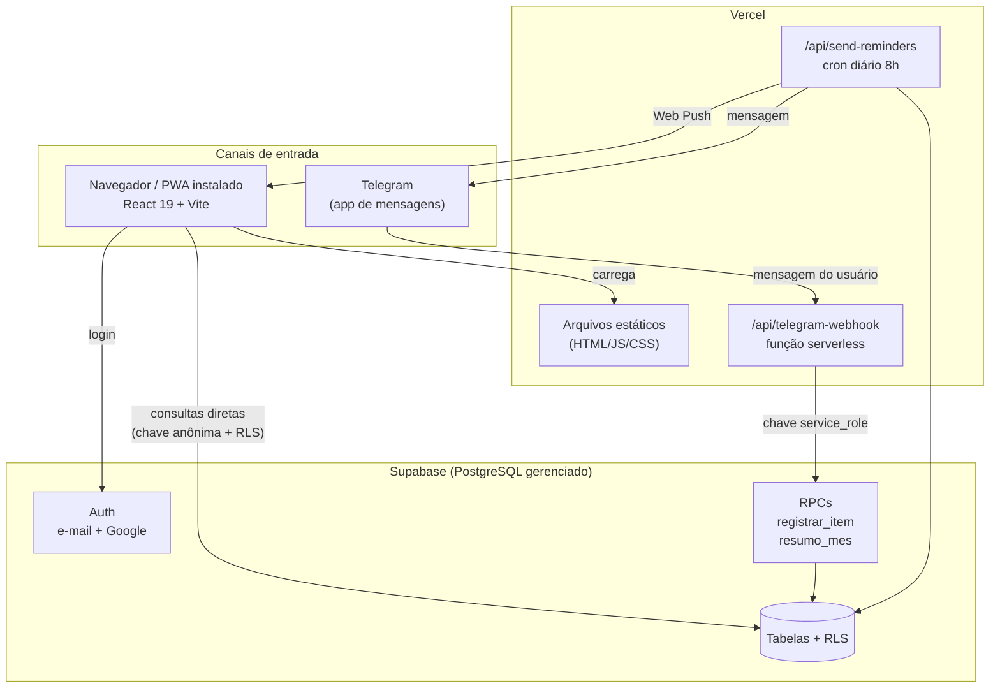
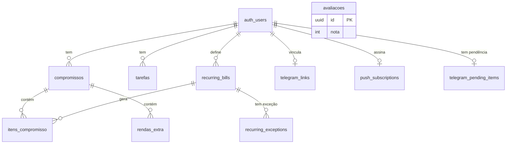

# SaiDaDívida — Documento Técnico para Apresentação

**Disciplina:** Projeto Integrador
**Etapa no CVDS:** 8 — Manutenção · **Etapa no CVBD:** 8 — Manutenção
**Produção:** https://saidadivida2.vercel.app
**Base:** este documento descreve o código real do repositório. Onde algo não está
implementado, isso é dito explicitamente — a seção 9 lista as limitações conhecidas.

---

## 1. Visão geral do projeto

### O que é

O SaiDaDívida é um aplicativo web de controle financeiro pessoal, organizado **mês a mês**.
O usuário registra sua renda (principal e extras) e os compromissos financeiros daquele mês
— aluguel, luz, parcelas —, marca o que já pagou e acompanha em tempo real quanto sobra e
quanto falta. O problema que ele resolve é o da pessoa endividada que não sabe *para onde
vai o dinheiro*: sem essa visibilidade, não há como decidir o que cortar. O público-alvo é
o brasileiro adulto endividado ou no limite do orçamento, que não usa planilha por achar
trabalhoso — daí a existência do bot do Telegram, que permite registrar um gasto em cinco
segundos sem abrir o app.

### Elevator pitch (30 segundos)

> "O SaiDaDívida é um app de controle financeiro mês a mês. Você lança sua renda e suas
> contas, marca o que pagou, e vê na hora quanto sobra e quais contas estão atrasadas. O
> diferencial é que dá pra registrar gasto pelo Telegram — você manda 'mercado 54,90' pro
> bot e ele salva no app. É um PWA, instala no celular como aplicativo, e cada usuário só
> enxerga os próprios dados, garantido pelo próprio banco de dados."

---

## 2. Stack tecnológica e justificativas

### Linguagem: JavaScript (ES Modules)

Uma linguagem só do início ao fim — front-end, funções serverless e scripts. Isso elimina
troca de contexto e permite reaproveitar código entre navegador e servidor.

**Por que não TypeScript?** Foi uma escolha consciente de escopo. TypeScript daria
segurança de tipos, e num projeto maior eu usaria. Aqui, com um desenvolvedor e prazo de
disciplina, o custo de configurar e tipar tudo não se pagaria. O preço é real: erros que o
TypeScript pegaria em tempo de compilação só aparecem em execução. É uma dívida técnica
assumida, não um descuido.

### Front-end: React 19.2 + Vite 8.0

**React** por ser o ecossistema com mais material e componentes prontos, e porque a tela
principal é intensamente reativa — marcar um item como pago recalcula percentual, saldo,
contador de atrasadas e situação do mês simultaneamente. O modelo de estado do React faz
isso naturalmente: eu mudo o dado, a interface se atualiza sozinha.

**Por que React e não Vue ou Angular?** Angular é um framework opinativo, pesado, pensado
para times grandes e aplicações corporativas — traria estrutura demais para o tamanho do
projeto. Vue seria uma escolha tecnicamente defensável e até mais simples de aprender; a
decisão pendeu para React por volume de documentação e por ser a habilidade com maior
demanda no mercado.

**Por que Vite e não Next.js?** Next.js entrega renderização no servidor (SSR), rotas por
arquivo e otimizações de SEO. O SaiDaDívida é um app **atrás de login**: não há conteúdo
público para indexar (só a landing, que é uma página só) e não há benefício de SSR quando
todo dado depende do usuário autenticado. Next.js seria complexidade sem contrapartida.
Vite entrega build muito rápido e um servidor de desenvolvimento com recarga instantânea.

### Estilização: CSS puro com variáveis nativas (CSS Custom Properties)

Um único arquivo, `src/index.css`, com um sistema de *design tokens* no prefixo `--sdd-*`.

**Por que não Tailwind?** O motivo decisivo foi o **tema claro/escuro**. Com variáveis CSS,
a troca de tema é uma linha: o seletor `.theme-light` redefine os tokens e o app inteiro
muda. Nenhum componente precisa saber qual tema está ativo. Com Tailwind eu teria classes
`dark:` espalhadas por toda parte. O custo dessa escolha é que não há garantia automática
de consistência — foi preciso auditar manualmente cada cor, o que gerou as fases 13 e 14
descritas na seção 6.

### Backend: Funções serverless na Vercel (`/api`)

Não existe servidor rodando o tempo todo. Há duas funções que executam sob demanda:

| Arquivo | O que faz | Quando executa |
|---|---|---|
| `api/telegram-webhook.js` | Recebe as mensagens do bot | A cada mensagem enviada ao bot |
| `api/send-reminders.js` | Envia lembretes de vencimento | Diariamente às 8h (cron da Vercel) |

**Por que serverless?** O app quase não precisa de backend — o front-end fala direto com o
Supabase. Só duas coisas exigem servidor: receber o webhook do Telegram (o Telegram precisa
de uma URL pública) e rodar tarefa agendada. Manter um servidor ligado 24h para isso seria
desperdício. Serverless cobra por execução e escala sozinho.

### Banco de dados: Supabase (PostgreSQL gerenciado)

Esta é a decisão mais importante do projeto. O Supabase entrega quatro coisas que, juntas,
substituem um backend inteiro:

1. **PostgreSQL de verdade** — banco relacional completo, com chaves estrangeiras, tipos,
   índices, restrições e funções. Não é um "banco simplificado".
2. **Autenticação pronta** — cadastro, login, login com Google, recuperação de senha e
   gestão de sessão. Escrever isso com segurança levaria semanas.
3. **Row Level Security (RLS)** — a regra de "cada um vê só o seu" mora **no banco**, não
   no código. Explicado em detalhe na seção 4.
4. **API REST automática** — cada tabela vira endpoint automaticamente; não escrevi um
   único endpoint CRUD.

**O que um "banco simples" não resolveria:** num MySQL cru, a segurança dependeria de eu
lembrar de escrever `WHERE user_id = ...` em toda consulta. Esquecer uma vez vaza dados de
outro usuário. Com RLS, o banco recusa a consulta mesmo que o código peça errado — a
segurança deixa de depender de disciplina do programador.

**Ressalva honesta:** o Supabase oferece *realtime* (atualização automática entre abas) e o
projeto **não usa**. Os dados são recarregados ao trocar de mês ou recarregar a página.

### Hospedagem e CI/CD: Vercel

Todo `git push` para a branch `main` dispara automaticamente: instalação de dependências →
`npm run build` → publicação. Se o build falhar, a versão no ar continua a anterior.

**O que é CI/CD neste contexto:** *Continuous Integration* é a integração contínua do
código (cada push é verificado ao ser construído); *Continuous Deployment* é a publicação
automática do que passou. Na prática: eu não faço deploy manualmente, nunca subo arquivo
por FTP, e não existe "funciona na minha máquina" — o build roda no servidor da Vercel.

### Ferramentas de IA no desenvolvimento: Claude Code

Sendo transparente sobre o processo: o desenvolvimento foi feito em par com o Claude Code,
assistente de IA no terminal, com este fluxo:

1. **Eu defino o que fazer** — cada fase começou com um enunciado meu descrevendo o
   objetivo, os critérios de aceite e as restrições.
2. **A IA implementa e verifica** — escreve o código e roda scripts de verificação
   (medição de contraste, renderização de componentes, checagem de instalabilidade PWA).
3. **Eu reviso e testo** — várias correções nasceram de testes manuais meus que a IA não
   tinha como fazer, por não ter login no app.
4. **Eu decido as divergências** — quando a especificação estava ambígua ou a IA discordava
   da abordagem, a decisão foi minha.

Um exemplo concreto do valor desse fluxo está na seção 6: o diagnóstico do bug de
instalação do PWA foi feito consultando o próprio Chrome via protocolo de depuração, o que
derrubou a primeira hipótese — que estava errada. A IA acelerou a execução; a direção,
a validação e as decisões de produto foram minhas.

---

## 3. Arquitetura do sistema

### Diagrama



### Fonte única de verdade: as RPCs

O ponto crítico da arquitetura é que existem **dois canais de entrada** (o app e o bot) que
precisam produzir **exatamente o mesmo resultado**. Se cada um tivesse sua própria fórmula
de saldo, uma hora eles divergiriam — e um app financeiro que mostra dois números
diferentes para a mesma coisa perde a confiança do usuário.

A solução foi mover a lógica compartilhada para **funções dentro do banco** (RPCs). O bot
não calcula saldo: ele chama `resumo_mes` e mostra o que o banco devolveu. A fórmula existe
em um lugar só.

```
Antes:  app  → sua própria fórmula  → risco de divergir
        bot  → sua própria fórmula  ↗

Depois: app  ↘
              resumo_mes (no banco) → um resultado só
        bot  ↗
```

### Como funciona o PWA

PWA (*Progressive Web App*) é um site que o navegador trata como aplicativo instalável.
São três peças:

1. **`public/manifest.json`** — a "identidade" do app: nome, ícone, cor, e
   `"display": "standalone"`, que faz abrir sem a barra de endereço do navegador.
2. **`public/sw.js` (service worker)** — um script que roda em segundo plano, entre o app e
   a rede. Ele guarda os arquivos em cache e permite receber notificações push. A estratégia
   é diferente por tipo: páginas HTML usam *network-first* (busca a rede primeiro, para o
   usuário sempre pegar a versão nova) e arquivos JS/CSS com hash no nome usam *cache-first*
   (não mudam sem trocar de nome, então servir do cache é seguro e instantâneo).
3. **Captura do evento de instalação** — um script no `index.html` guarda o evento
   `beforeinstallprompt` assim que o Chrome o dispara, permitindo oferecer o botão
   "Instalar" no momento certo. O porquê de isso estar no HTML e não no React é uma
   história que vale contar — está na seção 6.

No iPhone nada disso vale para instalação: o Safari não expõe esse evento, e o único
caminho é o usuário usar **Compartilhar → Adicionar à Tela de Início**. Por isso o app
detecta iOS e mostra a instrução em vez de um botão que não funcionaria.

---

## 4. Banco de dados

### Aviso sobre o schema legado

O repositório contém dois scripts: `schema.sql` (v1) e `schema_v2.sql` (v2). **Só o v2 está
em uso.** As tabelas do v1 — `usuarios`, `perfil_financeiro`, `gastos`, `dividas`,
`planos_gerados` e a view `vw_resumo_perfil` — pertencem a uma versão anterior sem
autenticação e são acessadas apenas por `src/services/storage.js`, arquivo que **nenhum
componente importa**. É código morto mantido no histórico. Se a banca perguntar sobre o
`schema.sql`, esta é a resposta honesta.

### Tabelas em uso (10)

#### `compromissos` — o mês financeiro do usuário

| Coluna | Tipo | Chave / Restrição |
|---|---|---|
| `id` | UUID | PK, gerada automaticamente |
| `user_id` | UUID | FK → `auth.users`, obrigatória, cascata |
| `mes_referencia` | TEXT | obrigatória. Ex.: `'Julho/2026'` |
| `renda_mensal` | DECIMAL(10,2) | padrão 0 |
| `renda_recorrente` | BOOLEAN | obrigatória, padrão `false` |
| `dia_recebimento` | INTEGER | nullable |
| `created_at` | TIMESTAMPTZ | padrão `NOW()` |
| — | — | **UNIQUE (user_id, mes_referencia)** |

A restrição UNIQUE é o que garante que um usuário não tenha dois "Julho/2026".

#### `itens_compromisso` — cada conta dentro de um mês

| Coluna | Tipo | Chave / Restrição |
|---|---|---|
| `id` | UUID | PK |
| `compromisso_id` | UUID | FK → `compromissos`, obrigatória, cascata |
| `nome_item` | TEXT | obrigatória |
| `valor` | DECIMAL(10,2) | obrigatória, padrão 0 |
| `data_vencimento` | DATE | **nullable** (conta sem prazo definido) |
| `pago` | BOOLEAN | padrão `false` |
| `categoria` | TEXT | padrão `'Outros'` |
| `recurring_bill_id` | UUID | FK → `recurring_bills`, **nullable**, `ON DELETE SET NULL` |
| `created_at` | TIMESTAMPTZ | padrão `NOW()` |
| — | — | **UNIQUE (compromisso_id, nome_item)** |

`recurring_bill_id` nulo significa "item avulso". `ON DELETE SET NULL` é deliberado: apagar
o modelo de recorrência **não** apaga o histórico já lançado — os itens apenas deixam de
ser recorrentes.

#### `rendas_extra` — receitas além do salário

| Coluna | Tipo | Chave |
|---|---|---|
| `id` | UUID | PK |
| `compromisso_id` | UUID | FK → `compromissos`, obrigatória, cascata |
| `descricao` | TEXT | obrigatória |
| `valor` | DECIMAL(10,2) | obrigatória, padrão 0 |
| `created_at` | TIMESTAMPTZ | padrão `NOW()` |

#### `recurring_bills` — modelo de conta que se repete

| Coluna | Tipo | Chave / Restrição |
|---|---|---|
| `id` | UUID | PK |
| `user_id` | UUID | FK → `auth.users`, obrigatória |
| `name` | TEXT | obrigatória |
| `category` | TEXT | padrão `'Outros'` |
| `default_amount` | DECIMAL(10,2) | obrigatória, padrão 0 |
| `due_day` | INTEGER | obrigatória, CHECK entre 1 e 31 |
| `active` | BOOLEAN | obrigatória, padrão `true` |
| `created_at` | TIMESTAMPTZ | padrão `NOW()` |

É um **molde**, não uma conta. "Aluguel, R$ 1.500, todo dia 5" fica aqui uma vez só; as
contas mensais são geradas a partir dele.

#### `recurring_exceptions` — "não gere este modelo neste mês"

| Coluna | Tipo | Chave / Restrição |
|---|---|---|
| `id` | UUID | PK |
| `recurring_bill_id` | UUID | FK → `recurring_bills`, obrigatória, cascata |
| `mes_referencia` | TEXT | obrigatória |
| `tipo` | TEXT | obrigatória, padrão `'excluida'` |
| `created_at` | TIMESTAMPTZ | padrão `NOW()` |
| — | — | **UNIQUE (recurring_bill_id, mes_referencia)** |

Tabela criada para corrigir um bug real (seção 6). O campo `tipo` já nasce aberto para
casos futuros, como "valor alterado só neste mês", sem exigir nova migração.

#### `tarefas` — lista de afazeres, independente do financeiro

| Coluna | Tipo | Chave |
|---|---|---|
| `id` | UUID | PK |
| `user_id` | UUID | FK → `auth.users`, obrigatória |
| `titulo` | TEXT | obrigatória |
| `anotacoes` | TEXT | nullable |
| `data_vencimento` | DATE | nullable |
| `concluida` | BOOLEAN | padrão `false` |
| `prioridade` | TEXT | padrão `'normal'` |
| `created_at` | TIMESTAMPTZ | padrão `NOW()` |

#### `telegram_links` — vínculo entre conta do app e Telegram

| Coluna | Tipo | Chave |
|---|---|---|
| `id` | UUID | PK |
| `user_id` | UUID | FK → `auth.users`, obrigatória, **UNIQUE** |
| `telegram_chat_id` | TEXT | nullable |
| `telegram_username` | TEXT | nullable |
| `link_token` | TEXT | nullable — código temporário de 6 caracteres |
| `token_expires_at` | TIMESTAMPTZ | nullable — validade de 10 minutos |
| `linked_at` | TIMESTAMPTZ | nullable |

#### `telegram_pending_items` — gasto aguardando confirmação no bot

| Coluna | Tipo | Chave |
|---|---|---|
| `chat_id` | TEXT | **PK** (uma pendência por conversa) |
| `user_id` | UUID | FK → `auth.users`, obrigatória |
| `mes_referencia` | TEXT | obrigatória |
| `nome_item` | TEXT | obrigatória |
| `valor` | DECIMAL(10,2) | obrigatória |
| `categoria` | TEXT | obrigatória, padrão `'Outros'` |

#### `push_subscriptions` — inscrição para notificação push

| Coluna | Tipo | Chave |
|---|---|---|
| `id` | UUID | PK |
| `user_id` | UUID | FK → `auth.users`, obrigatória, **UNIQUE** |
| `subscription` | JSONB | obrigatória — endpoint e chaves de criptografia |

#### `avaliacoes` — feedback anônimo da landing page

| Coluna | Tipo | Chave |
|---|---|---|
| `id` | UUID | PK |
| `nota` | INTEGER | obrigatória, CHECK entre 1 e 5 |
| `comentario` | TEXT | nullable |

Única tabela sem dono: qualquer visitante pode inserir e ler, por ser feedback público.

### Relacionamentos em português simples

- Um **usuário** tem muitos **compromissos** (um por mês). Cada compromisso pertence a um único usuário.
- Um **compromisso** tem muitos **itens** e muitas **rendas extras**. Cada item pertence a um único compromisso.
- Um **usuário** tem muitos **modelos de recorrência**. Cada modelo pode gerar muitos itens, em meses diferentes.
- Um **item** pode ter vindo de um modelo de recorrência, ou não (aí é avulso).
- Um **modelo de recorrência** pode ter muitas **exceções**, no máximo uma por mês.
- Um **usuário** tem no máximo **um** vínculo de Telegram e **uma** inscrição push.
- **Avaliações** não pertencem a ninguém.

### Diagrama entidade-relacionamento



Leitura dos símbolos: `||` = exatamente um · `o{` = zero ou muitos · `o|` = zero ou um.

### Row Level Security (RLS)

**O que é:** um mecanismo do PostgreSQL que aplica um filtro obrigatório em toda consulta a
uma tabela. Não é um `WHERE` que o programador escreve — é uma regra que o banco impõe,
inclusive quando o código pede a tabela inteira.

**Por que existe neste projeto:** o front-end fala **direto** com o banco, usando a chave
anônima, que é pública (está no JavaScript, qualquer um vê). Sem RLS, alguém poderia abrir o
console do navegador e pedir todos os compromissos de todos os usuários. Com RLS, o banco
devolve apenas as linhas do usuário autenticado — a chave anônima sozinha não abre nada.

**Exemplo real, da tabela `itens_compromisso`:**

```sql
CREATE POLICY "itens_user" ON itens_compromisso
  FOR ALL USING (
    compromisso_id IN (
      SELECT id FROM compromissos WHERE user_id = auth.uid()
    )
  );
```

Traduzindo: "permita operar sobre um item apenas se o compromisso dele pertencer ao usuário
logado". `auth.uid()` é uma função do Supabase que devolve o ID de quem está autenticado
naquela requisição.

Repare que `itens_compromisso` **não tem** coluna `user_id`. O dono é descoberto subindo até
a tabela pai. É o mesmo padrão em `rendas_extra` e `recurring_exceptions`.

### RPCs — funções dentro do banco

Uma RPC (*Remote Procedure Call*) aqui é uma função PL/pgSQL que o cliente chama pelo nome,
como se fosse um endpoint. O projeto tem duas, criadas para o bot do Telegram.

#### `registrar_item(user_id, mes_referencia, nome_item, valor, categoria, data_vencimento)`

Procura o compromisso do mês; se não existir, cria; então insere o item e devolve a linha
criada.

**Por que no banco e não no código?** Porque são duas operações que precisam acontecer
juntas. Feito no código, seriam duas viagens de rede: buscar/criar o mês, depois inserir. Se
duas mensagens do bot chegassem ao mesmo tempo no primeiro dia do mês, ambas veriam "não
existe" e tentariam criar — a segunda quebraria na restrição UNIQUE. Dentro do banco é uma
chamada só, executada de forma atômica.

#### `resumo_mes(user_id, mes_referencia)`

Devolve renda principal, total de extras, renda total, gastos, pago, saldo, quanto falta,
percentual e os 3 próximos vencimentos.

**Por que no banco?** É a **fonte única de verdade** descrita na seção 3. A fórmula do saldo
— `(renda_mensal + extras) - gastos` — precisa ser idêntica no app e no bot. Colocá-la no
banco torna impossível divergir.

Ambas são `SECURITY DEFINER`, ou seja, executam com os privilégios de quem as criou, e não
de quem chama — necessário porque o bot age em nome do usuário sem ter a sessão dele. Como
contrapartida de segurança, ambas fixam `SET search_path = public`, o que impede um tipo de
ataque em que alguém cria uma tabela falsa em outro schema para a função usar sem perceber.

---

## 5. Fluxos principais

### 5.1 Cadastrar um item novo

1. Usuário toca no **+** da barra inferior (celular) ou em "Novo Item" (desktop).
2. Abre o formulário: nome, valor, vencimento, categoria e a opção "Repetir todo mês".
3. Ao salvar, o React valida no navegador: nome não vazio, valor maior que zero. Se falhar,
   mostra a mensagem e **não** chama o banco.
4. `createItem()` envia o INSERT para `itens_compromisso` via Supabase.
5. O banco aplica a política RLS: o `compromisso_id` pertence a este usuário? Se não,
   recusa.
6. Se "Repetir todo mês" estava marcado, `setBillRecurring()` cria o modelo em
   `recurring_bills` e grava o `recurring_bill_id` de volta no item recém-criado.
7. O item entra **no topo** da lista local com um destaque que esvai em 1,5s, para o
   usuário ver o resultado da própria ação.
8. Os totais recalculam automaticamente, porque derivam do array de itens.

### 5.2 Marcar um item como pago

1. Usuário toca no círculo da coluna "Pago" (ou arrasta o card para a direita, no celular).
2. `togglePago()` faz um UPDATE mudando só o campo `pago`.
3. A resposta do banco substitui o item no estado local.
4. **Tudo que deriva disso é recalculado na mesma renderização:**

| Valor | Fórmula |
|---|---|
| Total pago | soma dos itens com `pago = true` |
| Falta pagar | total de gastos − total pago |
| Percentual | (total pago ÷ total de gastos) × 100 |
| Contas atrasadas | itens não pagos com vencimento anterior a hoje |
| Situação | compara gastos com renda total |

5. Aparece um aviso com opção **Desfazer**, que reverte o campo.

Detalhe importante: nada disso é gravado como "total" no banco. Os totais são **sempre
calculados** a partir dos itens. Isso evita o clássico problema de o total salvo divergir
das linhas que o compõem.

### 5.3 Registrar um gasto pelo Telegram

1. Usuário manda `mercado 54,90` para o bot.
2. O Telegram faz POST em `/api/telegram-webhook` na Vercel.
3. **Primeira coisa:** o handler compara o cabeçalho
   `X-Telegram-Bot-Api-Secret-Token` com o segredo configurado. Se não bater, responde 401 e
   para. Isso impede que alguém que descubra a URL injete mensagens falsas.
4. Busca em `telegram_links` de quem é aquele `chat_id`. Sem vínculo, pede para conectar.
5. **Interpreta o texto** com três padrões, testados nesta ordem:

| Padrão | Exemplo |
|---|---|
| 1 — verbo primeiro | `gastei 50 no mercado` |
| 2 — valor primeiro | `50 mercado` |
| 3 — descrição primeiro | `mercado 54,90` |

   Aceita vírgula ou ponto como separador decimal, e adivinha a categoria por palavras-chave
   ("mercado" → Alimentação).

6. **Não salva ainda.** Grava em `telegram_pending_items` e responde com botões
   **[Confirmar] [Trocar categoria] [Cancelar]** — porque interpretar linguagem natural
   erra, e gravar errado sem avisar é pior do que perguntar.
7. Ao confirmar, chama a RPC `registrar_item`.
8. **Só responde ✅ se o banco confirmar.** Em erro, responde "❌ Não consegui salvar" e
   registra o erro real no log. Nunca finge sucesso.
9. Na próxima vez que o app carregar aquele mês, o item aparece — vindo do mesmo banco.

### 5.4 Autenticação

Três caminhos, todos pelo Supabase Auth:

- **Cadastro por e-mail** — `signUp()`; o Supabase cuida do hash da senha.
- **Login por e-mail** — `signInWithPassword()`.
- **Login com Google** — `signInWithOAuth()`; o usuário é redirecionado ao Google e volta
  autenticado. O app nunca vê a senha do Google.

Depois do login, o Supabase guarda um **JWT** no navegador e o envia em toda consulta. É
desse token que o banco extrai o `auth.uid()` usado pelas políticas RLS.

O app escuta `onAuthChange`, então login e logout se refletem na interface na hora, sem
recarregar. Enquanto o Supabase não responde, a tela mostra "Carregando" — o estado da
sessão começa como `undefined`, o que é diferente de "sem sessão".

**O que não existe:** recuperação de senha ("esqueci minha senha") não está implementada na
interface, e não há verificação de e-mail obrigatória.

---

## 6. Decisões de design e desafios reais

### 6.1 O item excluído que voltava sozinho

**Sintoma:** o usuário apagava uma conta recorrente, a linha sumia — e voltava ao recarregar
a página.

**Investigação:** o primeiro palpite razoável seria "a exclusão falhou e a interface removeu
a linha otimistamente". Lendo o código, essa hipótese caiu: `handleDelete` aguarda o
resultado e só remove a linha se o banco confirmou. Se o DELETE falhasse, a linha **ficaria**
na tela. Logo, a exclusão estava funcionando — algo estava **recriando** o item.

**Causa raiz:** toda vez que um mês era aberto, a função `materializeRecurringForMonth`
reinseria todos os modelos ativos, *antes* de listar os itens. A intenção era gerar as contas
fixas do mês; o efeito colateral era desfazer exclusões. Faltavam duas coisas no modelo de
dados: um vínculo entre o item e o modelo que o gerou, e um registro de "o usuário excluiu
esta ocorrência".

**Correção:** coluna `recurring_bill_id` ligando item ao modelo, e a tabela
`recurring_exceptions` guardando as exclusões. A materialização passou a consultar as
exceções e pular o que foi excluído. E a exclusão de um recorrente virou uma escolha:
"só este mês" ou "as próximas ocorrências".

**Detalhe de projeto que vale mencionar:** se a leitura das exceções falhar, a função
**aborta** em vez de materializar. Materializar sem saber o que foi excluído traria de volta
justamente os itens apagados — em caso de dúvida, é melhor não gerar nada do que gerar
errado. Isso se chama *falhar fechado*.

O mesmo desenho corrigiu um segundo problema com a mesma origem: antes não havia como parar
a repetição sem apagar o histórico.

### 6.2 O botão de instalar que nunca aparecia

**Sintoma relatado:** "o botão de instalar o app está pouco visível no celular".

**Investigação:** a primeira hipótese foi de que o app reprovava nos critérios de
instalabilidade do Chrome, porque o manifesto declara apenas ícone SVG. Em vez de confiar
nessa memória, perguntei ao próprio Chrome via protocolo de depuração — e a hipótese estava
**errada**: zero erros de instalabilidade, SVG aceito, service worker ativo, evento
disparado normalmente.

Medindo o momento do disparo, apareceu a causa real:

```
beforeinstallprompt disparou em 402ms
na tela nesse instante → landing=true, sidebar=false
```

O único ouvinte do evento estava dentro do componente `Sidebar`, que **só é montado depois
do login**. O evento dispara em 400ms, ainda na landing, quando esse componente não existe —
e o navegador não o dispara de novo. O botão não estava "pouco visível": ele **nunca
aparecia** no Android.

**Correção:** mover a captura para um script no `index.html`, que roda antes de tudo, e
guardar o evento num pequeno *store* que qualquer parte do app pode consumir depois. No
caminho, dois outros defeitos apareceram: o botão continuava na tela depois de o usuário
recusar o prompt (embora o evento seja de uso único, virando um botão morto), e a detecção
de iPad falhava porque o iPadOS 13+ se identifica como "Macintosh".

**Lição da apresentação:** a primeira hipótese plausível estava errada, e só medir revelou
isso. Diagnosticar por medição, não por palpite.

### 6.3 O tema claro que não era claro

**Sintoma:** ao ativar o modo claro, cards apareciam pretos sobre fundo branco e textos
ficavam ilegíveis.

**Causa raiz:** o projeto tem duas gerações de variáveis CSS — as antigas (`--bg-card`,
`--text-main`) e as novas (`--sdd-*`). O seletor `.theme-light` só redefinia as antigas. Todo
componente migrado para o namespace novo continuava com as cores do escuro.

**Correção e um efeito colateral interessante:** ao redefinir o namespace completo, surgiu
um conflito. A cor de destaque do app é um verde-limão (`#A3E635`) que funciona muito bem
como texto sobre fundo escuro, e péssimo sobre branco. A solução foi separar o token em dois:
`--sdd-accent` para **preenchimentos** (barra de progresso, checkbox) e `--sdd-accent-strong`
para **texto e ícones** — este último vira verde-escuro no tema claro. Isso exigiu revisar
cada uso de cor no projeto e classificá-lo.

### 6.4 O valor que aparecia duplicado

**Sintoma:** a coluna "Valor" mostrava `R$ 180,00R$ 180`.

**Causa raiz:** há duas versões do valor — com centavos no desktop, sem centavos no celular.
As regras de exibição estavam ambas dentro da media query de celular:

```css
@media (max-width: 767px) {
  .item-value-desktop { display: none; }
  .item-value-mobile  { display: inline; }
}
```

Faltava a regra base. Fora da media query, `.item-value-mobile` herdava o padrão de um
`<span>`, que é visível — então no desktop os dois apareciam. Correção: uma linha
declarando `display: none` como padrão.

**Por que isso é interessante para a banca:** é um erro de raciocínio sobre a cascata do
CSS, não de digitação. Quem escreve "esconder no celular" às vezes esquece de definir o que
acontece fora do celular.

### 6.5 Vermelho demais na tela

**Sintoma:** todos os valores não pagos apareciam em vermelho, dando aparência de alerta
generalizado.

**Achado:** ao investigar, a lógica do desktop já estava correta — os itens do teste
estavam **realmente** todos vencidos. Mas dois problemas reais apareceram: no celular o
vermelho **nunca** aparecia (uma regra CSS fixava a cor neutra, sobrescrevendo a semântica),
e uma conta que vencia **hoje** já era marcada como atrasada desde a meia-noite, porque a
comparação era com o instante atual em vez do início do dia.

**Lição:** o sintoma relatado não era o bug; investigar a fundo revelou dois outros. Nem
sempre o usuário descreve a causa certa — mas o incômodo dele é sempre um sinal legítimo.

### 6.6 Por que o trabalho foi feito em fases

O redesign visual e as correções foram organizados em fases numeradas (1 a 18), cada uma com
escopo declarado, critérios de aceite e verificação ao final. As razões:

1. **Cada fase é reversível.** Um commit por fase permite voltar atrás sem desfazer o resto.
2. **Escopo declarado evita "enquanto estou aqui".** Quando o escopo diz "só cores, zero
   lógica", uma mudança de comportamento no meio salta aos olhos na revisão.
3. **Verificação incremental.** Testar um redesign inteiro de uma vez é inviável; testar
   uma fase é factível.
4. **O histórico vira documentação.** O `git log` conta a evolução do projeto — foi dele que
   saíram os casos desta seção.

Custo honesto: mais tempo em coordenação e retrabalho quando uma fase revelava que a
anterior tinha errado (as fases 17.1 e 15.1 são exatamente isso — correções de fases
imediatamente anteriores).

---

## 7. Perguntas prováveis da banca

### "Por que Supabase e não um banco tradicional com backend próprio?"

Pelo tempo. Um backend próprio exigiria escrever autenticação, hash de senha, gestão de
sessão, endpoints CRUD e regras de permissão — semanas de trabalho, cada peça uma
oportunidade de erro de segurança. O Supabase entrega isso pronto e, o mais importante, com
RLS: as regras de acesso ficam no banco, não espalhadas pelo código. E não é uma
tecnologia "de brinquedo" — por baixo é PostgreSQL puro, com todas as funções, índices e
restrições que eu quiser usar. Se um dia for preciso sair, o banco é padrão e migra.

### "Como você garante a segurança dos dados financeiros?"

Em quatro camadas:

1. **Autenticação** pelo Supabase Auth, com senhas em hash — o projeto nunca vê a senha.
2. **RLS no banco.** Toda tabela de usuário tem política. A chave usada pelo front é
   pública, mas sozinha não abre nada — o banco filtra pela identidade do token.
3. **A chave poderosa nunca vai ao navegador.** A `service_role`, que ignora RLS, só existe
   nas variáveis de ambiente da Vercel, usada pelas funções serverless. Se ela vazasse,
   qualquer um leria tudo.
4. **O webhook é autenticado.** O endpoint do Telegram valida um cabeçalho secreto e
   responde 401 sem ele — a URL sozinha não é suficiente para injetar mensagens.

**Sendo honesto sobre limites:** os valores ficam em texto claro no banco (sem criptografia
em nível de coluna), o Supabase gerenciado é quem controla a criptografia em repouso, e não
houve auditoria de segurança independente. Para um trabalho acadêmico é adequado; para um
produto financeiro real, faltariam auditoria, criptografia de campos sensíveis e
autenticação em duas etapas.

### "O que acontece se dois usuários editarem ao mesmo tempo?"

Primeiro, uma distinção: **dois usuários diferentes nunca editam o mesmo dado** — o RLS
isola cada um, não há dado compartilhado no sistema.

O caso real é o **mesmo usuário em dois dispositivos**, ou o app e o bot ao mesmo tempo.
Aí a resposta honesta é: **a última escrita vence**. Não há bloqueio nem controle de versão.
Se eu edito o valor de uma conta no celular e no computador simultaneamente, o último UPDATE
sobrescreve o outro, sem aviso.

O que **está** protegido são as duplicidades, por restrições no banco: `UNIQUE (user_id,
mes_referencia)` impede dois "Julho/2026", e `UNIQUE (compromisso_id, nome_item)` impede
duas contas com o mesmo nome no mês. E a RPC `registrar_item` resolve a corrida entre app e
bot ao criar o mês, por ser atômica.

Se fosse evoluir, eu adicionaria uma coluna de versão e recusaria o UPDATE se a versão
mudou desde a leitura — o chamado *bloqueio otimista*.

### "Como você testou o sistema?"

Com franqueza: **não há suíte de testes automatizados** no repositório. Não há Vitest, Jest
nem Testing Library, e `package.json` não tem script `test`. Foi uma escolha de escopo, e é
a maior dívida técnica do projeto.

O que **foi** feito:

1. **ESLint** em todo o código, verificando erros e padrões de React.
2. **Verificação por medição em pontos críticos** — em vez de "parece certo", medir. O
   contraste das cores foi calculado pela fórmula da WCAG contra os tokens reais, em quatro
   combinações de tema e tamanho de tela; a instalabilidade do PWA foi consultada no próprio
   Chrome; a lógica de recorrência foi exercitada com um cliente de banco simulado que grava
   as chamadas, verificando ordem e alvos.
3. **Teste manual de ponta a ponta** nos fluxos principais, incluindo o do Telegram —
   registrar pelo bot, conferir que aparece no app e que o `/saldo` bate com a tela.
4. **Build de produção** a cada mudança; a Vercel não publica build quebrado.

O que eu faria com mais tempo: testes unitários das regras de cálculo (saldo, atraso,
recorrência), que são puros e fáceis de testar, e testes de integração dos fluxos de
exclusão.

### "Qual foi a maior dificuldade técnica?"

O bug da recorrência (6.1) — não pela correção, que é simples, mas pelo diagnóstico. O
sintoma ("apaguei e voltou") sugeria falha na exclusão, e o instinto era investigar
permissões. Só lendo o fluxo com calma ficou claro que a exclusão funcionava e que outra
coisa recriava o item. Foi a lição mais valiosa: **o sintoma raramente aponta a causa**.

Em segundo lugar, o tema claro (6.3), por um motivo diferente: não foi um bug pontual, e sim
uma consequência de ter duas gerações de variáveis CSS convivendo. Dívida técnica cobrando
juros.

### "O sistema escala? O que mudaria com 10 mil usuários?"

Hoje ele **não** está pronto para isso, e sei onde quebra:

1. **Consulta N+1 no Analytics.** A tela carrega todos os meses e depois faz uma consulta de
   itens **por mês**. Com 24 meses são 25 idas ao banco por abertura de tela. Correção:
   uma consulta só com JOIN, ou uma RPC agregando no banco — mesmo padrão do `resumo_mes`.

2. **O cron de lembretes não paginaria.** Ele busca todos os vencimentos do dia de todos os
   usuários de uma vez e envia em sequência. Com 10 mil usuários, isso estoura o tempo
   limite da função serverless. Correção: processar em lotes e usar fila.

3. **Planos gratuitos.** Vercel Hobby e Supabase Free têm limites de banda, execuções e
   conexões simultâneas. Escalar começa por pagar pelos planos adequados.

4. **Índices.** Existem os das chaves e restrições UNIQUE, além de um em `recurring_bill_id`.
   Com volume, eu mediria as consultas reais e provavelmente criaria índice em
   `itens_compromisso(compromisso_id, pago)` e em `data_vencimento`, que é o filtro do cron.

O que **já** escala bem: as funções serverless sobem instâncias sozinhas, os arquivos
estáticos vão por CDN, e o RLS não fica mais lento com mais usuários — é um filtro por linha,
não uma varredura.

### "Por que React 19 e não uma versão estável mais antiga?"

React 19 é estável. A versão foi definida ao criar o projeto com o template atual do Vite,
que já traz a mais recente. Na prática o projeto usa recursos clássicos — `useState`,
`useEffect`, `useCallback` — e um recurso moderno: `useSyncExternalStore`, no controle do
estado de instalação do PWA, que é a forma correta de o React consumir um estado que vive
fora dele (nesse caso, um evento do navegador capturado antes do React existir).

### "O bot do Telegram é seguro? Alguém pode registrar gasto na minha conta?"

Três barreiras:

1. **Vínculo por código temporário.** Para conectar, é preciso gerar no app um código de 6
   caracteres válido por 10 minutos e enviá-lo ao bot. Sem estar logado, não há código.
2. **O bot só age sobre quem está vinculado.** Ele identifica o usuário pelo `chat_id` da
   conversa consultando `telegram_links`. Uma conversa não vinculada não registra nada.
3. **O webhook valida um segredo.** Mesmo quem descubra a URL do endpoint não consegue
   injetar mensagens falsas sem o cabeçalho correto — recebe 401.

**Limite honesto:** se alguém tiver acesso físico ao celular destravado com o Telegram
aberto, pode registrar gastos. O bot não pede confirmação de identidade a cada mensagem.

### "Por que armazenar o mês como texto ('Julho/2026') e não como data?"

É uma decisão discutível e eu defendo com ressalva. A favor: o mês é um **rótulo**, não uma
data — não existe "dia" no conceito de mês de referência, e o texto aparece direto na
interface sem conversão. Contra, e isso é real: não dá para comparar com `>` no SQL, então
filtrar "meses futuros" exige converter para número no código (é o que
`excluirOcorrenciasFuturas` faz). Também é sensível a grafia — "Julho/2026" e "julho/2026"
seriam meses diferentes.

Se fosse refazer, eu usaria um `DATE` fixado no dia 1º, ou um inteiro `ano*12+mês`, e
formataria o rótulo na exibição.

### "O que tem no projeto que não está no ar?"

Existem componentes no repositório que **não estão ligados à aplicação**: `KanbanTab`,
`FocusTimer`, `DividasForm`, `GastosForm`, `ProfileForm`, `HistoricoPlanos`,
`PlanoResultado` e `Navbar` não são importados por nenhuma tela. São resquícios de versões
anteriores. A landing page ainda anuncia "Kanban Financeiro" e "Timer de Foco" como
funcionalidades — **isso é um erro da landing** que precisa ser corrigido, e prefiro dizer
antes de ser perguntado.

As telas realmente acessíveis são quatro: **Início**, **Histórico**, **Analytics** e
**Tarefas**.

---

## 8. Glossário

| Termo | O que é |
|---|---|
| **PWA** | *Progressive Web App*. Site que o navegador instala como aplicativo, com ícone na tela inicial e funcionamento sem barra de endereço. |
| **Service worker** | Script que roda em segundo plano, separado da página, entre o app e a rede. Permite cache e notificações push. |
| **Manifest** | Arquivo JSON que descreve o app ao navegador: nome, ícone, cor, modo de exibição. É o que torna um site instalável. |
| **RLS** | *Row Level Security*. Recurso do PostgreSQL que filtra linhas automaticamente conforme quem está consultando. A regra fica no banco, não no código. |
| **Policy** | A regra concreta de RLS, escrita em SQL. Ex.: "só veja linhas cujo `user_id` seja o seu". |
| **RPC** | *Remote Procedure Call*. Aqui, uma função escrita em SQL dentro do banco, chamada pelo nome como se fosse um endpoint. |
| **SECURITY DEFINER** | Marca uma função para executar com os privilégios de quem a criou, não de quem a chama. Necessária quando o bot age em nome do usuário. |
| **JWT** | *JSON Web Token*. Credencial assinada que o navegador envia a cada requisição, provando quem é o usuário. |
| **Chave anônima** | Chave pública do Supabase, usada no front. Sozinha não dá acesso a nada — depende do RLS e do token do usuário. |
| **service_role** | Chave do Supabase que **ignora** o RLS. Só pode existir no servidor. Se vazar, expõe todos os dados. |
| **Serverless** | Código que roda sob demanda, sem servidor ligado permanentemente. Cobra por execução e escala sozinho. |
| **CI/CD** | Integração e entrega contínuas. Todo push é construído e publicado automaticamente. |
| **Migração** | Script SQL que altera a estrutura do banco de forma versionada e repetível. |
| **Upsert** | Operação que insere se não existe e atualiza (ou ignora) se já existe. |
| **ON CONFLICT** | Cláusula do PostgreSQL que define o que fazer quando um INSERT viola uma restrição de unicidade. |
| **Idempotente** | Operação que pode ser repetida sem mudar o resultado. Rodar duas vezes é igual a rodar uma. |
| **Materialização** | Aqui: gerar as contas concretas de um mês a partir dos modelos de recorrência. |
| **Falhar fechado** | Diante de um erro, escolher não agir em vez de agir sem informação. |
| **Consulta N+1** | Antipadrão: buscar uma lista e depois fazer uma consulta para cada item dela. |
| **Bloqueio otimista** | Técnica contra escritas concorrentes: guardar uma versão e recusar o update se ela mudou. |
| **Design token** | Variável de design (cor, espaçamento) usada no lugar de valores fixos, permitindo trocar o tema num ponto só. |
| **WCAG** | Diretriz internacional de acessibilidade. Define, por exemplo, o contraste mínimo entre texto e fundo. |
| **TWA** | *Trusted Web Activity*. Forma de publicar um PWA na Play Store como app Android. **Não usada neste projeto** — o app é instalado direto pelo navegador. |

---

## 9. Limitações conhecidas

Declaradas para não serem descobertas pela banca:

1. **Sem testes automatizados.** Nenhum framework de teste instalado.
2. **Componentes órfãos.** Oito componentes no repositório não estão ligados à aplicação
   (`KanbanTab`, `FocusTimer`, `DividasForm`, `GastosForm`, `ProfileForm`,
   `HistoricoPlanos`, `PlanoResultado`, `Navbar`); a landing anuncia dois deles como
   funcionalidades. Junto deles, três serviços sem uso: `storage.js`, `calculadora.js` e
   `xpService.js` (este último era de um sistema de pontuação removido).
3. **Schema v1 morto.** Cinco tabelas e uma view sem uso, acessadas só por `storage.js`,
   que ninguém importa.
4. **Sem controle de concorrência.** Última escrita vence.
5. **Sem recuperação de senha** na interface.
6. **Consulta N+1 no Analytics.**
7. **iOS não verificado em aparelho real.** A detecção de iPhone/iPad tem teste, mas o
   comportamento de instalação no Safari não foi testado num dispositivo.
8. **Realtime não usado**, embora disponível no Supabase.
9. **Sem TypeScript.**

---

## 10. Resumo de uma página — ler antes de entrar

> **Imprima ou leia esta seção nos cinco minutos antes da apresentação.**

### O pitch
App de controle financeiro **mês a mês**. Lança renda e contas, marca o que pagou, vê quanto
sobra e o que está atrasado. Diferencial: registra gasto pelo **Telegram**. É **PWA**
(instala no celular). Cada usuário só vê o próprio dado — **garantido pelo banco**.

### A stack em uma linha cada
- **React 19 + Vite** — app reativo; sem Next.js porque tudo é atrás de login (SSR não ajuda).
- **CSS puro com variáveis** — sem Tailwind porque o tema claro/escuro troca num ponto só.
- **Supabase (PostgreSQL)** — banco + login + RLS prontos; sem backend próprio.
- **Vercel** — arquivos estáticos e duas funções serverless; deploy automático a cada push.

### Os três conceitos que preciso saber explicar
1. **RLS** — o banco filtra as linhas por usuário automaticamente. A chave do front é
   pública, mas sozinha não abre nada.
2. **RPC** — funções dentro do banco. `resumo_mes` existe para app e bot usarem **a mesma
   fórmula** e nunca divergirem.
3. **PWA** — manifest (identidade) + service worker (cache e push) = instalável.

### Os números
**10 tabelas** em uso · **2 RPCs** · **4 telas** (Início, Histórico, Analytics, Tarefas) ·
**58 commits** · **18 fases** de desenvolvimento.

### A fórmula que pode ser cobrada
```
saldo = (renda_mensal + rendas_extras) − total_de_gastos
```
Nunca é gravada: **sempre recalculada** a partir dos itens. Por isso total e linhas nunca
divergem.

### Dois casos para contar (mostram maturidade)
- **Item excluído voltava.** A exclusão funcionava; a geração automática de contas
  recorrentes recriava o item a cada carregamento. Corrigido com vínculo item↔modelo e
  tabela de exceções. **Lição: o sintoma não aponta a causa.**
- **Botão de instalar "invisível".** Medindo, descobri que ele **nunca aparecia** no
  Android: o evento dispara em 400ms, antes do componente que o escutava existir. Corrigido
  capturando no boot. **Lição: medir em vez de supor** — minha primeira hipótese estava
  errada.

### O que assumir sem hesitar se perguntarem
- **Testes?** Não há suíte automatizada. Houve ESLint, verificação por medição nos pontos
  críticos e teste manual. É a maior dívida técnica.
- **Concorrência?** Última escrita vence. Duplicidade é barrada por UNIQUE no banco.
- **Escala em 10 mil?** Não hoje. Sei onde quebra: N+1 no Analytics e o cron sem paginação.
- **Componentes órfãos?** Existem oito; a landing anuncia dois deles indevidamente.
- **IA no processo?** Sim, Claude Code. Eu defini escopo, revisei, testei e decidi as
  divergências.

### Frase de fechamento
> "O projeto está em produção, com os dados protegidos no nível do banco, dois canais de
> entrada compartilhando a mesma fonte de verdade, e um histórico de 18 fases que mostra
> como cada decisão foi tomada e corrigida."
