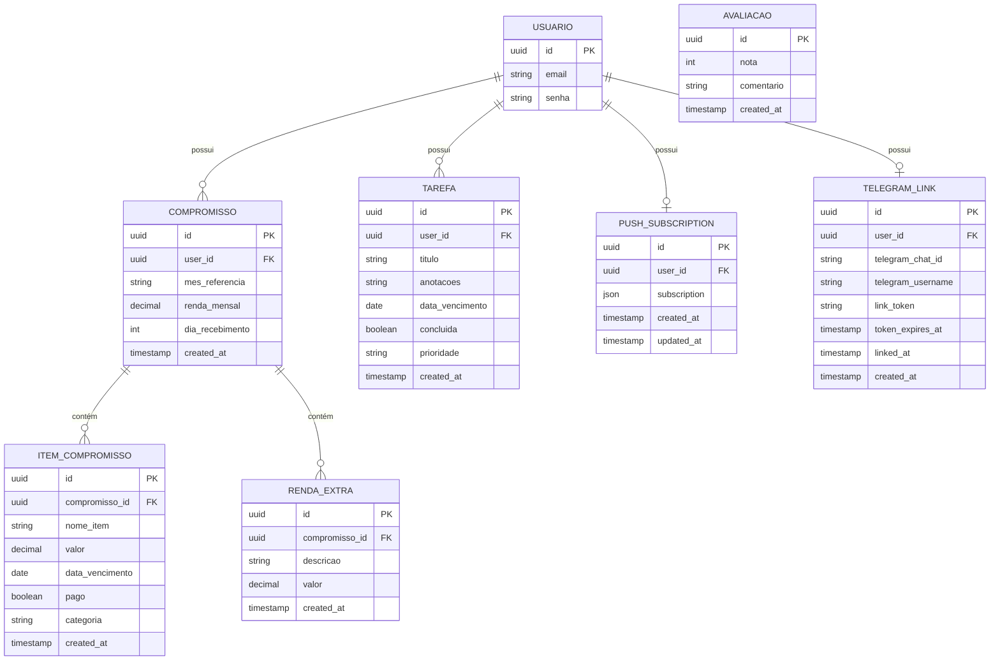

# Diagrama Entidade-Relacionamento (DER)
## SaiDaDívida v2 — Modelagem Conceitual

Este diagrama representa a etapa de **Modelagem Conceitual** do Ciclo de Vida do Banco de Dados (CVBD), onde são identificadas as entidades do sistema, seus atributos e os relacionamentos entre elas, sem considerar o SGBD específico.

---

## DER — Notação Entidade-Relacionamento

---

## Leitura do Diagrama

### Cardinalidades

| Relacionamento | Tipo | Significado |
|---|---|---|
| USUARIO → COMPROMISSO | 1:N | Um usuário pode ter vários compromissos mensais |
| USUARIO → TAREFA | 1:N | Um usuário pode ter várias tarefas |
| USUARIO → PUSH_SUBSCRIPTION | 1:0..1 | Um usuário tem no máximo uma inscrição push |
| USUARIO → TELEGRAM_LINK | 1:0..1 | Um usuário tem no máximo um vínculo Telegram |
| COMPROMISSO → ITEM_COMPROMISSO | 1:N | Um compromisso mensal contém vários itens de custo |
| COMPROMISSO → RENDA_EXTRA | 1:N | Um compromisso mensal pode ter várias rendas extras |
| AVALIACAO | — | Entidade independente, sem vínculo com usuário (anônima) |

### Notação utilizada

| Símbolo | Significado |
|---|---|
| `\|\|` | Um (obrigatório) |
| `o\|` | Um (opcional) |
| `o{` | Muitos (opcional) |
| `\|{` | Muitos (obrigatório) |

---

## Descrição das Entidades

### USUARIO
Entidade central do sistema, gerenciada pelo Supabase Auth. Representa o usuário autenticado que acessa a aplicação. Todas as demais entidades (exceto AVALIACAO) se relacionam com esta entidade.

### COMPROMISSO
Representa o registro financeiro mensal do usuário. Cada mês de referência é único por usuário — um usuário não pode ter dois registros para o mesmo mês.

### ITEM_COMPROMISSO
Representa cada despesa ou gasto dentro de um mês. Um compromisso mensal pode conter múltiplos itens, cada um com nome, valor, categoria e status de pagamento.

### RENDA_EXTRA
Representa receitas adicionais dentro de um mês, como freelances ou bônus. É separada da renda principal declarada no compromisso.

### TAREFA
Representa afazeres e lembretes do usuário, independentes do controle financeiro. Possui prioridade e data de vencimento opcionais.

### AVALIACAO
Entidade isolada que armazena avaliações anônimas da landing page. Não está vinculada a nenhum usuário, permitindo que qualquer visitante avalie o sistema.

### PUSH_SUBSCRIPTION
Armazena os dados necessários para envio de notificações push ao navegador do usuário. Cada usuário possui no máximo uma inscrição ativa.

### TELEGRAM_LINK
Armazena os dados de vinculação entre a conta do usuário na aplicação e o seu perfil no Telegram. Utiliza um token temporário para validar a conexão.

---

## Posição no CVBD

Este DER representa a **Etapa 2 — Modelagem Conceitual** do Ciclo de Vida do Banco de Dados.

| Etapa CVBD | Status |
|---|---|
| 1. Levantamento dos Requisitos de Dados | ✅ Concluído |
| **2. Modelagem Conceitual (DER)** | **✅ Este documento** |
| 3. Modelagem Lógica | ✅ Concluído |
| 4. Modelagem Física | ✅ Concluído |
| 5. Implementação | ✅ Concluído |
| 6. Testes | ⚠️ A documentar |
| 7. Operação | ✅ Em produção |
| 8. Manutenção | 🔄 Em andamento |
